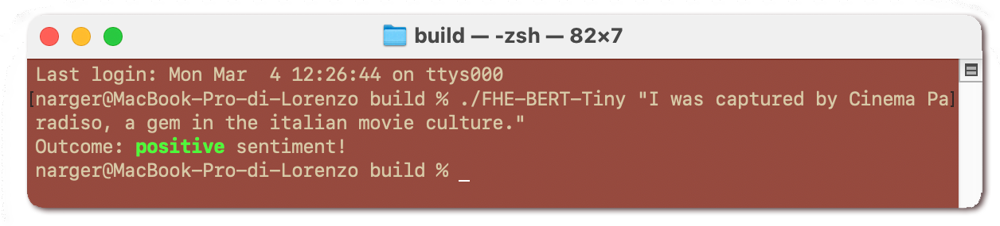
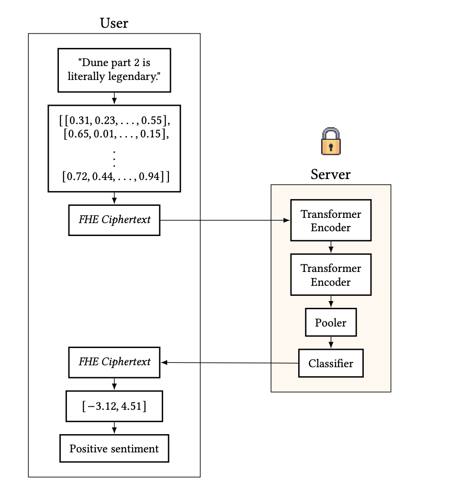

# Transformer-based Language Models and Homomorphic Encryption: an intersection with BERT-tiny
<center>

</center>

This repository contains the source code for the paper called *Transformer-based Language Models and Homomorphic Encryption: an intersection with BERT-tiny*, available at https://dl.acm.org/doi/10.1145/3643651.3659893

In particular, in contains a FHE-based circuit that implements the Transformer Encoder layers of BERT-tiny (available [here](https://huggingface.co/philschmid/tiny-bert-sst2-distilled)), fine-tuned on the SST-2 dataset.

## Prerequisites

Linux or Mac operative system

In order to run the program, you need to install:
- `cmake`
- `g++` or `clang`
- `OpenFHE` ([how to install OpenFHE](https://openfhe-development.readthedocs.io/en/latest/sphinx_rsts/intro/installation/installation.html))

Plus, since the tokenization process (done by the client) relies on PyTorch:
- `python`
- `pip`

## How to use it
After intalling all the required prerequisites, install the required Python libraries using pip:
```
pip install -r src/Python/requirements.txt
```

Then, it is possible to generate the set of keys for the CKKS scheme. Go to the `build` folder:

```
cd build
```

and run the following command:

```
./FHE-BERT-Tiny --generate_keys
```

This generates the required keys to evaluate the circuit. Optionally, it is possible to generate keys satisfying $\lambda = 128$ bits of security by adding the following flag (notice that this will generate a larger ring, leading to larger runtimes).

```
./FHE-BERT-Tiny --generate_keys --secure
```

This command will generate a `keys` folder in the root of the project folder, containing the serializations of the required keys. Now it is possible to run the FHE circuit by using this command

```
./FHE-BERT-Tiny "Dune part 2 was a mesmerizing experience, movie of the year?"
```

In general, the circuit can be evaluated as follows (after the generation of the keys):

```
./FHE-BERT-Tiny <text> [OPTIONS]
```
where

- `<text>` is the input text to be evaluated

and the optional `[OPTIONS]` parameters are:

- `--verbose` prints information during the evaluation of the network. It can be useful to study the precision of the circuit at the end of each layer
- `--plain` adds the result of the plain circuit at the end of the FHE evaluation

## Architecture

The circuit is built to be run by a honest-but-curious server, and it is evaluated according to the following high-level architecture:



Find more details on the paper.

## Some results
We present some results, obtained by taking sentences from the validation set of SST-2

|Sentence                                                                                                                                                                                               |Number of tokens|Output neurons distance     |Error               |Correct|Time|
|-------------------------------------------------------------------------------------------------------------------------------------------------------------------------------------------------------|------|--------------------|--------------------|-------|------|
|[CLS] like leon , it 's frustrating and still oddly likable .  [SEP]                                                                                                                                   |16    |0.7829569207192607  |0.2637289847915127  |True   |158   |
|[CLS] fancy a real downer ?  [SEP]                                                                                                                                                                     |8     |2.078040362538693   |0.10124830653429395 |True   |103   |
|[CLS] a rewarding work of art for only the most patient and challenge-hungry moviegoers .  [SEP]                                                                                                       |21    |4.71609452539902    |0.09666297965576498 |True   |184   |
|[CLS] not really bad so much as distasteful : we need kidnapping suspense dramas right now like we need doomsday thrillers .  [SEP]                                                                    |29    |2.647963995264761   |0.02138451441876841 |True   |233   |
|[CLS] for starters , the story is just too slim .  [SEP]                                                                                                                                               |12    |3.90750897644143    |0.043818370768947436|True   |133   |
|[CLS] this is a story of two misfits who do n't stand a chance alone , but together they are magnificent .  [SEP]                                                                                      |27    |1.849549346633772   |0.02379865699819895 |True   |218   |
|[CLS] for this reason and this reason only -- the power of its own steadfast , hoity-toity convictions -- chelsea walls deserves a medal .  [SEP]                                                      |34    |0.923304736775777   |0.1930003126325841  |True   |282   |
|[CLS] sticky sweet sentimentality , clumsy plotting and a rosily myopic view of life in the wwii-era mississippi delta undermine this adaptation .  [SEP]                                              |30    |1.558375092211876   |0.06276180683611574 |True   |239   |
|[CLS] a quiet treasure -- a film to be savored .  [SEP]                                                                                                                                                |15    |3.4104416509334037  |0.11312617566739674 |True   |143   |
|[CLS] serving sara does n't serve up a whole lot of laughs .  [SEP]                                                                                                                                    |16    |1.60711355774035    |0.11927832311378658 |True   |157   |
|[CLS] the best film about baseball to hit theaters since field of dreams .  [SEP]                                                                                                                      |15    |3.897422743537171   |0.08596409933485272 |True   |145   |
|[CLS] cq 's reflection of artists and the love of cinema-and-self suggests nothing less than a new voice that deserves to be considered as a possible successor to the best european directors .  [SEP]|40    |1.1848514115188333  |0.1400631497907136  |True   |327   |
|[CLS] one of creepiest , scariest movies to come along in a long , long time , easily rivaling blair witch or the others .  [SEP]                                                                      |29    |0.10826934561307422 |0.9006632442549082  |False  |234   |
|[CLS] its story may be a thousand years old , but why did it have to seem like it took another thousand to tell it to us ?  [SEP]                                                                      |29    |2.7564028774088447  |0.12348781954020985 |True   |226   |
|[CLS] ... plot holes so large and obvious a marching band might as well be stomping through them in clown clothes , playing a college football fight song on untuned instruments .  [SEP]              |39    |1.720810212313863   |0.01788143405025077 |True   |302   |
|[CLS] combining quick-cut editing and a blaring heavy metal much of the time , beck seems to be under the illusion that he 's shooting the latest system of a down video .  [SEP]                      |39    |2.9133043158894845  |0.03863443622330494 |True   |308   |
|[CLS] it is great summer fun to watch arnold and his buddy gerald bounce off a quirky cast of characters .  [SEP]                                                                                      |23    |3.952184191511266   |0.1379737017651776  |True   |201   |
|[CLS] the volatile dynamics of female friendship is the subject of this unhurried , low-key film that is so off-hollywood that it seems positively french in its rhythms and resonance .  [SEP]        |38    |4.2605415286889885  |0.1276253452964574  |True   |298   |
|[CLS] irwin is a man with enough charisma and audacity to carry a dozen films , but this particular result is ultimately held back from being something greater .  [SEP]                               |34    |2.1527231510539435  |0.18819938842863287 |True   |267   |
|[CLS] verbinski implements every hack-artist trick to give us the ooky-spookies .  [SEP]                                                                                                               |22    |1.0504313965615004  |0.26651379033525724 |True   |184   |
|[CLS] a romantic comedy enriched by a sharp eye for manners and mores .  [SEP]                                                                                                                         |16    |5.386228984969466   |0.009115561281949822|True   |148   |

## Citing

If you are planning to cite this work, feel free to do using the following BibTeX entry:

```
@inproceedings{10.1145/3643651.3659893,
  author = {Rovida, Lorenzo and Leporati, Alberto},
  title = {Transformer-based Language Models and Homomorphic Encryption: An Intersection with BERT-tiny},
  year = {2024},
  isbn = {9798400705564},
  publisher = {Association for Computing Machinery},
  address = {New York, NY, USA},
  url = {https://doi.org/10.1145/3643651.3659893},
  doi = {10.1145/3643651.3659893},
  booktitle = {Proceedings of the 10th ACM International Workshop on Security and Privacy Analytics},
  pages = {3–13},
  numpages = {11},
  keywords = {homomorphic encryption, natural language processing, secure machine learning},
  location = {Porto, Portugal},
  series = {IWSPA '24}
}
```

## Authors

- Lorenzo Rovida (`lorenzo.rovida@unimib.it`)
- Alberto Leporati (`alberto.leporati@unimib.it`)

Made with <3  at [Bicocca Security Lab](https://www.bislab.unimib.it), at University of Milan-Bicocca.


### Declaration

This is a proof of concept and, even though parameters are created with $\lambda \geq 128$ security bits (according to [Homomorphic Encryption Standards](https://homomorphicencryption.org/standard)), this circuit is intended for educational purposes only.
